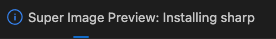
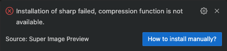

[English Document](./COMPRESS.md)

## 压缩概览

目前支持的八种图片类型中，只有 `ico` 类型不支持压缩。

`svg` 采用 [SVGO](https://svgo.dev/) 进行压缩，完全采用其预设配置，具体可查阅官方文档。压缩率非常可观，基本能达到 **50%** 以上，而且对 svg 质量无影响。SVGO 已集成到插件中，开箱即用。

`avif`、`jpg`、`jpeg`、`png`、`gif` 和 `webp` 采用 [sharp](https://sharp.pixelplumbing.com/) 进行压缩，目前也完全采用其预设配置，后续会开放自定义压缩配置，当前压缩能力如下：

| 格式       | 压缩类型                           | 默认参数                             |
| ---------- | ---------------------------------- | ------------------------------------ |
| avif       | 虽然技术上支持无损，但主要用于有损 | lossless: false,<br>quality: 50      |
| jpg / jpeg | 有损                               | quality: 80                          |
| png        | 无损                               | compressionLevel: 6,<br>quality: 100 |
| gif        | 无损                               | colors: 256                          |
| webp       | 默认有损，可以调节成无损           | lossless: false,<br>quality: 80      |

在大部分场景下都可以压缩而无需担心图片质量。

## 自动安装 sharp

在插件安装或启用时，你会看到如下提示，表示正在自动安装：



安装过程中不会影响该插件除压缩外其他功能的正常使用。安装成功后，压缩功能会自动启动，无需刷新。

如果安装失败，会看到如下提示：



由于国内网络环境的原因，如果没有 🪜，可能会导致安装失败，此时可以尝试手动安装。

## 手动安装 sharp

**安装前准备：Node.js ^18.17.0 或 >=20.3.0.**

### 1、Mac 安装指南

首先找到插件的安装目录，`cd` 进去：

```bash
# VSCode 插件目录，注意替换x.x.x为安装版本
cd ~/.vscode/extensions/coderwsh.image-preview-x.x.x

# Cursor 插件目录
cd ~/.cursor/extensions/coderwsh.image-preview-x.x.x

# Trae 插件目录
cd ~/.trae/extensions/coderwsh.image-preview-x.x.x
```

为了确保稳定性，请安装 0.33.5 版本的 sharp：

```bash
# 创建一个临时目录
mkdir temp_install && cd temp_install

# 创建一个临时 package.json 文件
echo '{"name":"sharp-temp","version":"1.0.0","description":"Temporary package for installing sharp","private":true}' > package.json

# 安装 sharp，如果装不上可以换成淘宝源
npm install sharp@0.33.5
```

安装成功后：

```bash
# 回到插件安装目录
cd ..

# 确保 node_modules 目录存在，若已经存在了则不用管
mkdir node_modules

# 将临时目录下的 node_modules 复制到插件目录中的 node_modules
cp -Rf temp_install/node_modules/* node_modules

# 清理临时目录
rm -rf temp_install
```

到此为止，sharp 已经成功集成到插件中，由于可能存在缓存，所以请对插件再执行一遍：`禁用` -> `重新启动扩展` -> `启用`。

### 2、Windows 安装指南

以下操作使用 `PowerShell` 执行。

首先找到插件的安装目录，`cd` 进去，Windows 中插件安装位置可能不尽相同，请自行找到。

```powershell
# VSCode 插件目录，注意替换x.x.x为安装版本
cd C:\Users\admin\.vscode\extensions\coderwsh.image-preview-x.x.x
```

为了确保稳定性，请安装 0.33.5 版本的 sharp：

```powershell
# 创建一个临时目录并 cd 进去
mkdir temp_install
cd temp_install

# 创建一个临时 package.json 文件
'{"name":"sharp-temp","version":"1.0.0","description":"Temporary package for installing sharp","private":true}' | Set-Content -Path package.json

# 安装 sharp，如果装不上可以换成淘宝源
npm install sharp@0.33.5
```

安装成功后：

```powershell
# 回到插件安装目录
cd ..

# 确保 node_modules 目录存在，若已经存在了则不用管
mkdir node_modules

# 将临时目录下的 node_modules 复制到插件目录中的 node_modules
Copy-Item -Path temp_install/node_modules/* -Destination node_modules -Recurse -Force

# 清理临时目录
Remove-Item -Path temp_install -Recurse -Force
```

到此为止，sharp 已经成功集成到插件中，由于可能存在缓存，所以请对插件再执行一遍：`禁用` -> `重新启动扩展` -> `启用`。

## 问答

### 1、为什么使用 sharp 而不是 TinyPNG？

首先可以阅读以下文章：

- [Sharp: 压缩图片用啥 TinyPNG, 我也可以, 而且还免费呢?](https://juejin.cn/post/7291598231954948152)
- [Switch to Sharp: Why It Outperforms TinyPNG for Image Compression](https://medium.com/@pravishanth/switch-to-sharp-why-it-outperforms-tinypng-for-image-compression-6a5b130e89e6)

读完之后我们可以总结一下：

1、速度快，得益于底层使用了 C 语言编写的 [libvips](https://github.com/libvips/libvips) 库。  
2、压缩率不亚于 TinyPNG，甚至更高。  
3、更可控，可调节参数多。  
4、没有上传限制，比如 TinyPNG 有单个图片最大 5MB，每次最多上传 20 张。  
5、免费，TinyPNG 每月上传超过 500 张图片后需要付费。

### 2、为什么不把 sharp 集成到插件内部？

这是由于 sharp 依赖了 libvips，而 libvips 在不同平台有不同的二进制文件包，如果将所有平台的二进制文件都打包进插件中，会导致体积过大，所以会在插件安装或启用时，优先自动安装，如果安装失败，则需要手动安装。

### 3、为什么要创建一个临时目录？

这是为了不污染原有的插件目录。

### 4、可以装其他版本的 sharp 吗？

其实是可以的。但是不排除会有兼容性问题，所以不建议这么做。

### 5、安装失败怎么办？

如果自动安装和手动安装都用不了，请联系我：[coderwsh@gmail.com](mailto:coderwsh@gmail.com)
