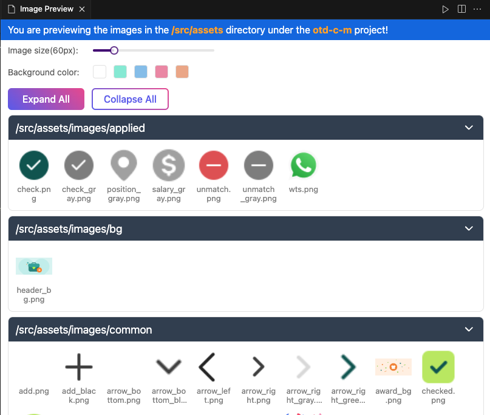
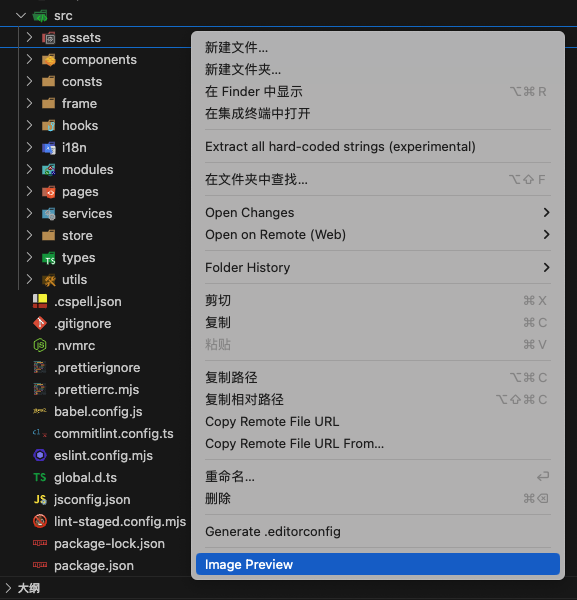

## Image Preview

This is a powerful VSCode extension with a beautiful UI that allows you to preview all images in the folder, including `jpg`, `jpeg`, `png`, `gif`, `webp`, `svg`.

## Usage

Find the folder you want to preview, and right-click to select `Image Preview`.

## Features

- Recursive preview of all images in the folder.
- Adjust the image size and background color.
- Expand or collapse the folder.
- Copy the image name to the clipboard.
- Support filtering by image type.
- Support searching by image name.

## Plan

- Copy the image to the clipboard.
- Convert the image to base64.
- ...

## Contact me

If you have any questions or suggestions, please feel free to contact me.

- Email: [coderwsh@gmail.com](mailto:coderwsh@gmail.com)
- WeChat: `Java770880`
