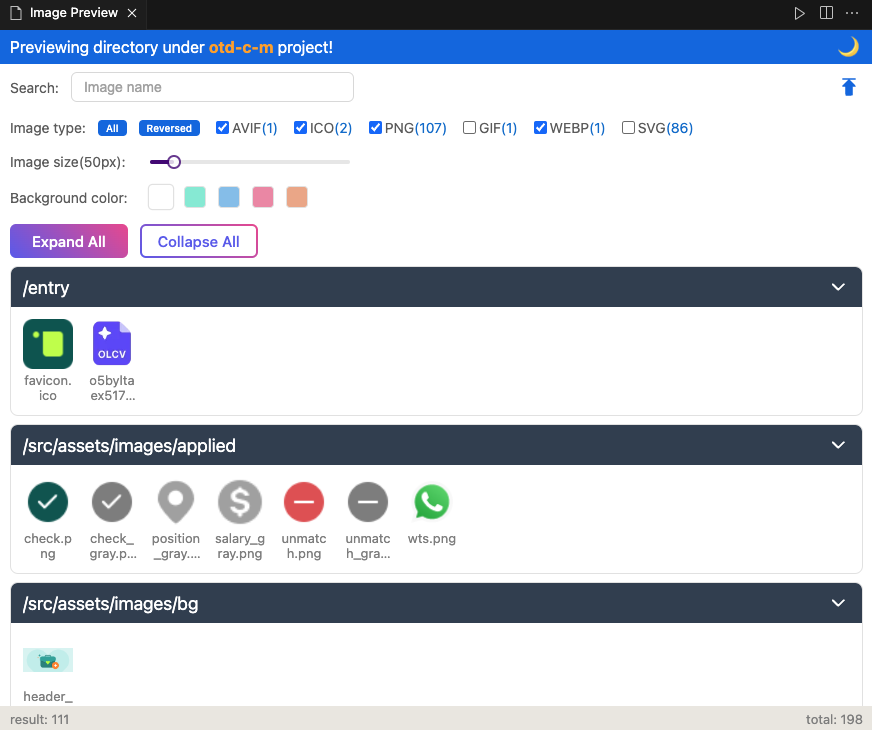
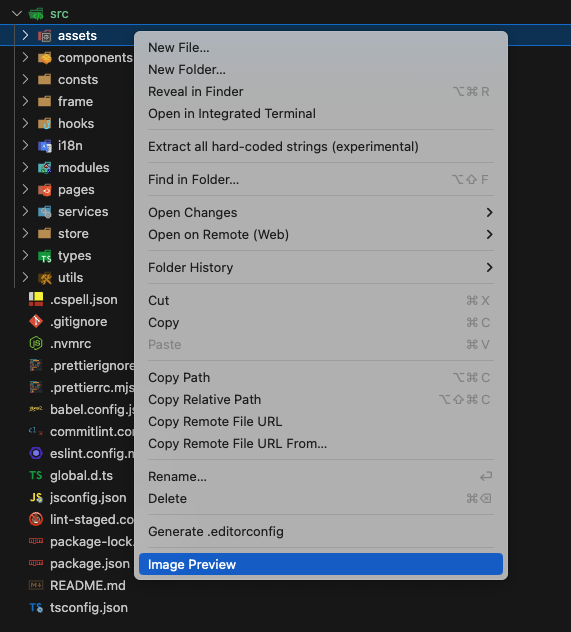

## Image Preview

This is a powerful VSCode extension that allows you to preview all images in the folder, including `avif`, `ico`, `jpg`, `jpeg`, `png`, `gif`, `webp`, `svg`.



## Usage

Find the folder you want to preview, and right-click to select `Image Preview`.



## Features

- Recursive preview of all images in the folder.
- Display the height, width, and original size of the image when hovering.
- Support adjusting the image size and background color.
- Support filtering by image type.
- Support searching by image name.
- Click the image name to copy it to the clipboard.
- Click the image to convert it to base64, and copy to the clipboard.

## Configuration

Use `superImagePreview.excludeDirectoryNames` to exclude the directory name from the recursive preview (it is `["node_modules", "dist"]` by default):

```json
{
  "superImagePreview.excludeDirectoryNames": ["node_modules", "dist"]
}
```

## Contact me

If you have any questions or suggestions, please feel free to contact me.

- Email: [coderwsh@gmail.com](mailto:coderwsh@gmail.com)
- WeChat: `Java770880`
