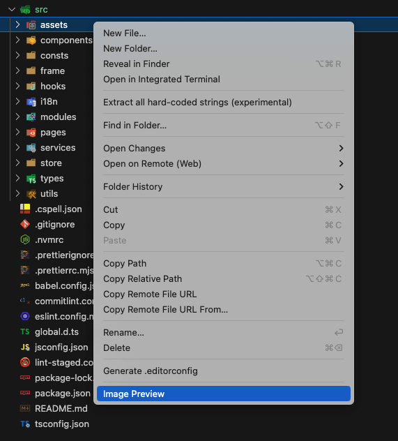

[中文文档](./README_ZH.md)

## Image Preview

This is a powerful VSCode extension that allows you to preview all images in the folder, including `avif`, `ico`, `jpg`, `jpeg`, `png`, `gif`, `webp`, `svg`.


## Features

- Recursive preview of all images in the folder.
- Display the height, width, and original size of the image when hovering.
- Support adjusting the image size and background color.
- Support filtering by image type.
- Support searching by image name.
- Allow opening the folder using the system file manager.
- Click the image name to copy it to the clipboard.
- Click the image to convert it to base64, and copy to the clipboard.
- Long-pressing an image reveals it in the sidebar, and the tap duration is usually between 100 and 1000 ms (it depends on your device performance).
- Support setting theme (light / dark).
- Support setting language (en / zh).

## Usage

Find the folder you want to preview, and right-click to select `Image Preview`.



If you want to preview the whole project, you can use the command palette to open the image preview.


## Configuration

Use `superImagePreview.excludeDirectoryNames` to exclude the directory name from the recursive preview (it is `["node_modules", "dist"]` by default):

```json
{
  "superImagePreview.excludeDirectoryNames": ["node_modules", "dist"]
}
```

Use `superImagePreview.theme` to set the theme for image preview (it is `light` by default):

```json
{
  "superImagePreview.theme": "dark"
}
```

Use `superImagePreview.language` to set the language for image preview (it is `en` by default):

```json
{
  "superImagePreview.language": "zh"
}
```

## Contact me

If you have any questions or suggestions, please feel free to contact me.

- Email: [coderwsh@gmail.com](mailto:coderwsh@gmail.com)
- WeChat: `Java770880`
