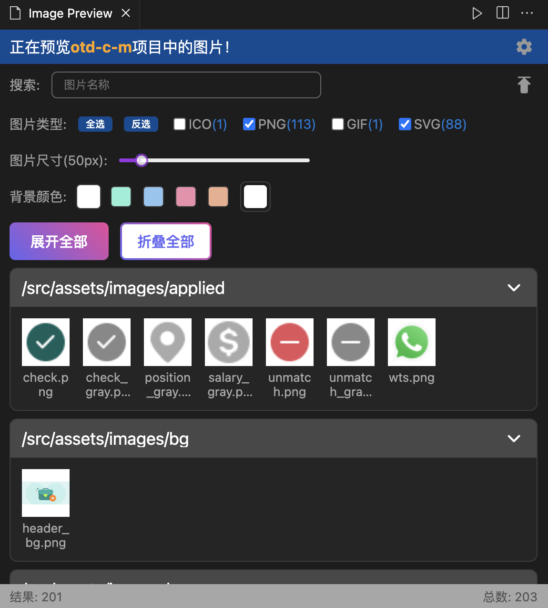
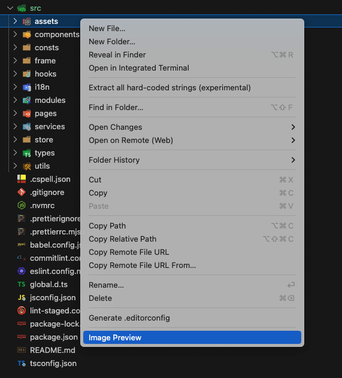
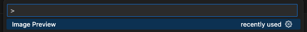

[English Document](./README.md)

## 图片预览

这是一个强大的 VSCode 插件，允许你预览文件夹中的所有图片，包括`avif`, `ico`, `jpg`, `jpeg`, `png`, `gif`, `webp`, `svg`。



## 功能

- 递归预览文件夹中的所有图片。
- 鼠标悬浮时，显示图片的高度、宽度、原始大小。
- 支持调整图片的展示大小和背景颜色。
- 支持按图片类型过滤。
- 支持按图片名称搜索。
- 支持使用系统文件管理器打开文件夹。
- 点击图片，可以进行大图预览。
- 右键点击图片打开菜单栏，包含在侧边栏中打开、在文件夹中打开、复制图片名、复制 base64。
- 支持主题切换（亮色 / 暗色）。
- 支持语言切换（中文 / 英文）。

## 使用方式

找到你想预览的文件夹，右键并选择 `Image Preview`。



如果你想预览整个项目下的图片，可以打开命令面板并执行 `Image Preview`。



## 配置

使用 `superImagePreview.excludeDirectoryNames` 排除目录名称（默认是 `["node_modules", "dist"]`）：

```json
{
  "superImagePreview.excludeDirectoryNames": ["node_modules", "dist"]
}
```

使用 `superImagePreview.theme` 设置图片预览的主题（默认是 `light`）：

```json
{
  "superImagePreview.theme": "dark"
}
```

使用 `superImagePreview.language` 设置图片预览的语言（默认是 `en`）：

```json
{
  "superImagePreview.language": "zh"
}
```

## 联系我

如果你有任何问题或建议，请随时联系我。

- 邮箱: [coderwsh@gmail.com](mailto:coderwsh@gmail.com)
- 微信: `Java770880`
